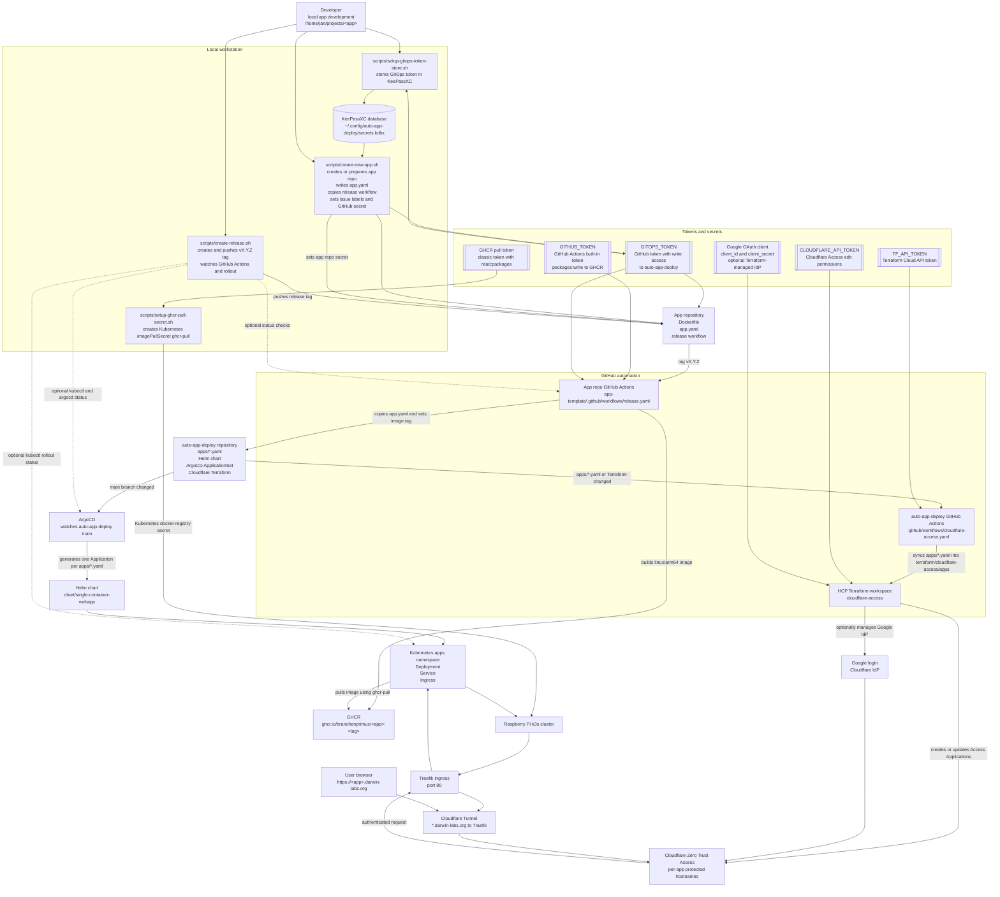

# Deployment Flow

## Notes

- App repositories own source code, `Dockerfile`, `app.yaml`, and the release workflow.
- `auto-app-deploy` owns desired deployment state in `apps/*.yaml`, the shared Helm chart, ArgoCD wiring, and Cloudflare Access Terraform.
- App releases are driven by Git tags. The app workflow builds the image, pushes it to GHCR, and commits the updated app values into `auto-app-deploy`.
- ArgoCD turns `apps/*.yaml` into Kubernetes resources through the shared Helm chart.
- Terraform turns `apps/*.yaml` into Cloudflare Access applications and can either reuse an existing Google IdP ID or manage the Cloudflare Google IdP from Google OAuth credentials.
- Runtime traffic flows through Cloudflare Tunnel, Cloudflare Access, Traefik, and then the Kubernetes service for the app.
